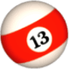

## A billiard simulation
<a href="https://a-billiard-simulation.vercel.app/" target="_blank">
 
</a> 

## Introduction
- Date: October 2022 to Febraury 2023
- Personal project in 'Introduction of Computer Graphics' class
- It shows a billiard simulation implemented [Elastic Collision](https://en.wikipedia.org/wiki/Elastic_collision#One-dimensional_Newtonian).

## Features
- Click the “Reset Speed” button to assign new velocity vector to each ball.
- When rebounding off the cushion, the velocity of each ball drops by 20%.
- Due to friction on the pool table, each ball's velocity drops by 20% every second.
- The position, intensity, angle and color of the light, as well as the velocity volume, can be adjusted in the Debug UI.

## Built with

* Vite.js provided by [Three.js journey](https://threejs-journey.com/)
* Debug UI from [lil-gui](https://lil-gui.georgealways.com/)

## Issues
- Balls sometimes roll over with attached.